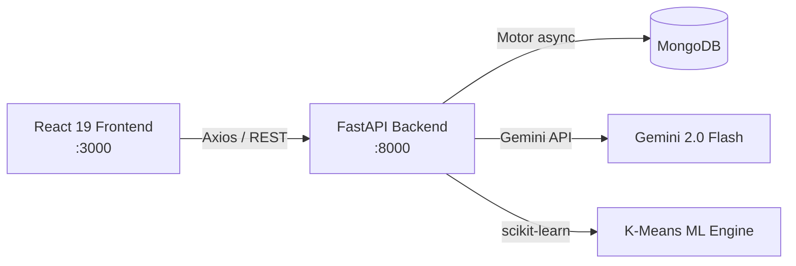
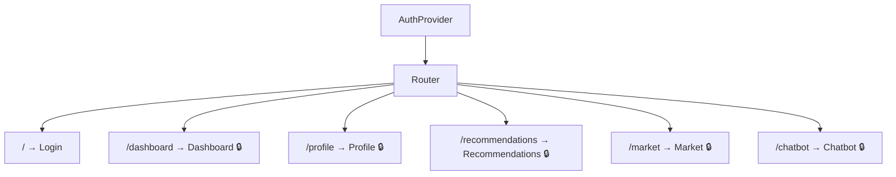
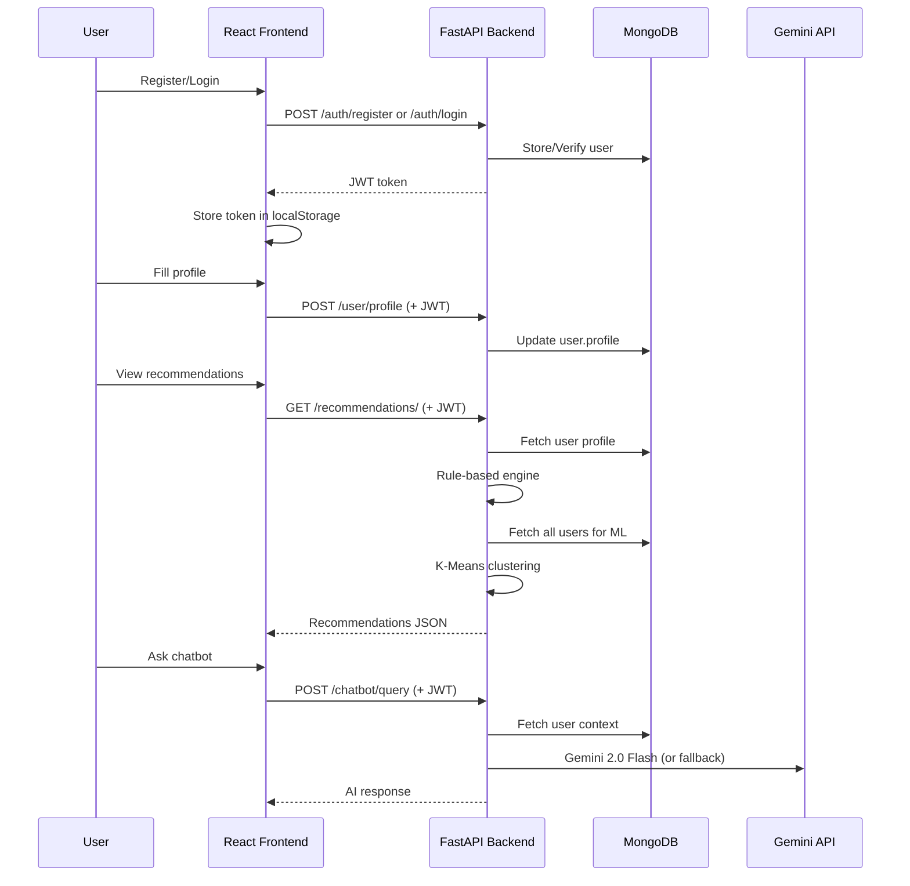

# Pocket Buddy

AI-Powered WealthTech Web Application for Personalized Financial Planning

## Problem Statement

Many individuals struggle with making informed investment decisions due to:
- Lack of financial knowledge
- Overwhelming amount of market information
- No personalized guidance
- Difficulty in creating diversified portfolios

## Solution Overview

Pocket Buddy is a full-stack AI-powered financial advisory platform that provides:
- Personalized investment recommendations
- Real-time market insights
- AI chatbot for financial queries
- Portfolio allocation suggestions

## Architecture

```
┌─────────────────┐     ┌─────────────────┐     ┌─────────────────┐
│   React.js      │────▶│   FastAPI       │────▶│   MongoDB       │
│   Frontend      │◄────│   Backend       │◄────│   Database      │
└─────────────────┘     └─────────────────┘     └─────────────────┘
                               │
                               ▼
                        ┌─────────────────┐
                        │   Gemini API    │
                        │   ML Models     │
                        └─────────────────┘
```

## Tech Stack

### Frontend
- React.js (Functional Components + Hooks)
- React Router (Routing)
- Context API (State Management)
- Traditional CSS (Styling)
- Axios (HTTP Client)

### Backend
- FastAPI (Python Web Framework)
- PyMongo/Motor (MongoDB Async Driver)
- JWT (Authentication)
- Passlib + Bcrypt (Password Hashing)
- Google Gemini API (AI Chatbot)
- scikit-learn (ML Clustering)

### Database
- MongoDB (NoSQL Database)

## Project Structure

```
pocket-buddy/
├── backend/
│   ├── app/
│   │   ├── main.py              # FastAPI application entry
│   │   ├── config.py            # Configuration settings
│   │   ├── database.py          # MongoDB connection
│   │   ├── models/
│   │   │   └── user.py          # User data models
│   │   ├── routes/
│   │   │   ├── auth.py          # Authentication endpoints
│   │   │   ├── user.py          # User profile endpoints
│   │   │   ├── recommendations.py # Investment recommendations
│   │   │   ├── market.py        # Market data endpoints
│   │   │   └── chatbot.py       # Chatbot endpoints
│   │   ├── services/
│   │   │   ├── auth_service.py       # Auth business logic
│   │   │   ├── recommendation_service.py # AI recommendation engine
│   │   │   ├── market_service.py       # Market data service
│   │   │   └── chatbot_service.py      # AI chatbot service
│   │   └── utils/
│   │       └── auth.py          # JWT utilities
│   ├── requirements.txt         # Python dependencies
│   └── .env.example            # Environment variables template
├── frontend/
│   ├── src/
│   │   ├── context/
│   │   │   └── AuthContext.js   # Authentication context
│   │   ├── components/
│   │   │   └── PrivateRoute.js  # Protected route component
│   │   ├── pages/
│   │   │   ├── Login.js         # Login/Register page
│   │   │   ├── Dashboard.js     # Main dashboard
│   │   │   ├── Profile.js       # User profile setup
│   │   │   ├── Recommendations.js # Investment recommendations
│   │   │   ├── Market.js        # Market insights
│   │   │   └── Chatbot.js       # AI chatbot interface
│   │   ├── App.js               # Main app component
│   │   └── index.css            # Global styles
│   └── package.json             # Node dependencies
└── README.md                    # This file
```

## API Endpoints

### Authentication
- `POST /auth/register` - Register new user
- `POST /auth/login` - Login user
- `GET /auth/me` - Get current user info

### User Profile
- `POST /user/profile` - Update user profile
- `GET /user/profile` - Get user profile

### Recommendations
- `GET /recommendations/` - Get personalized recommendations
- `GET /recommendations/portfolio-suggestion` - Get portfolio allocation

### Market Data
- `GET /market/indices` - Get market indices
- `GET /market/stock/{symbol}` - Get stock quote
- `GET /market/trending` - Get trending stocks
- `GET /market/search` - Search instruments

### Chatbot
- `POST /chatbot/query` - Send query to chatbot
- `GET /chatbot/suggestions` - Get suggested questions

## Setup Instructions

### Prerequisites
- Python 3.8+
- Node.js 14+
- MongoDB (local or Atlas)

### Backend Setup

1. Navigate to backend directory:
```bash
cd backend
```

2. Create virtual environment:
```bash
python -m venv venv
```

3. Activate virtual environment:
```bash
# Windows
venv\Scripts\activate

# macOS/Linux
source venv/bin/activate
```

4. Install dependencies:
```bash
pip install -r requirements.txt
```

5. Create `.env` file:
```bash
cp .env.example .env
```

6. Update `.env` with your values:
```
MONGODB_URL=mongodb://localhost:27017
DB_NAME=pocket_buddy
SECRET_KEY=your-secret-key
GEMINI_API_KEY=your-gemini-api-key
```

7. Start the server:
```bash
uvicorn app.main:app --reload
```

Backend will run at `http://localhost:8000`

### Frontend Setup

1. Navigate to frontend directory:
```bash
cd frontend
```

2. Install dependencies:
```bash
npm install
```

3. Start the development server:
```bash
npm start
```

Frontend will run at `http://localhost:3000`

## Features

### 1. User Authentication
- JWT-based authentication
- Secure password hashing with bcrypt
- Protected routes

### 2. User Profile
- Collects age, income, savings
- Risk appetite assessment
- Financial goals
- Investment preferences

### 3. AI Recommendation Engine

#### Rule-Based Logic:
- Low risk → Bonds, low-risk mutual funds
- High risk → Stocks, aggressive portfolios
- Short-term goals → Liquid funds
- Long-term goals → Equity funds

#### ML-Based (K-Means Clustering):
- Groups similar users
- Collaborative filtering
- Personalized recommendations

### 4. Market Data
- Real-time market indices
- Stock quotes
- Trending stocks
- Search functionality

### 5. AI Chatbot
- Natural language queries
- Context-aware responses
- Google Gemini integration
- Rule-based fallback

## Future Improvements

- [ ] Portfolio tracking and performance
- [ ] Price alerts and notifications
- [ ] Risk simulation dashboard
- [ ] Voice-based chatbot
- [ ] Integration with real brokerage APIs
- [ ] Advanced ML models (deep learning)
- [ ] Mobile app (React Native)
- [ ] Social features (compare portfolios)

---

## Development Details

### System Architecture



| Layer | Tech | Key Libraries |
|-------|------|---------------|
| Frontend | React 19 (CRA) | react-router-dom 7, recharts, axios, Context API |
| Backend | FastAPI (Python) | motor, passlib+bcrypt, python-jose (JWT), google-generativeai, scikit-learn |
| Database | MongoDB | Async via Motor driver |

---

### Backend Deep Dive

#### Entry Point — `main.py`

- FastAPI app with **lifespan** context manager for DB connect/disconnect
- CORS configured for `localhost:3000`
- Mounts 5 routers: `auth`, `user`, `recommendations`, `market`, `chatbot`
- Health check at `/health`

#### Configuration — `config.py`

- Uses `pydantic-settings` with `.env` file support
- Settings: MongoDB URL, DB name, JWT secret, algorithm (HS256), token expiry (30 min), Gemini API key

#### Database — `database.py`

- `Motor` async MongoDB client
- Singleton `Database` class with `connect_db()` / `close_db()` lifecycle
- Helper: `get_collection(name)` to access any collection

#### Data Models — `models/user.py`

| Model | Fields | Purpose |
|-------|--------|---------|
| `UserCreate` | email, full_name, password | Registration |
| `UserLogin` | email, password | Login |
| `UserProfile` | age, income, savings, risk_appetite, financial_goals, investment_preferences | Profile data |
| `Token` | access_token, token_type | JWT response |

- `risk_appetite` is a `Literal["low", "medium", "high"]`
- `financial_goals` is a `Literal["short-term", "long-term"]`

---

### API Routes (Detailed)

#### Auth — `routes/auth.py`

| Endpoint | Method | Auth | Description |
|----------|--------|------|-------------|
| `/auth/register` | POST | ✗ | Register with email + password, returns JWT |
| `/auth/login` | POST | ✗ | Login, returns JWT |
| `/auth/me` | GET | ✓ | Get current user info |

#### User — `routes/user.py`

| Endpoint | Method | Auth | Description |
|----------|--------|------|-------------|
| `/user/profile` | POST | ✓ | Update profile (age, income, risk, goals) |
| `/user/profile` | GET | ✓ | Get saved profile |

#### Recommendations — `routes/recommendations.py`

| Endpoint | Method | Auth | Description |
|----------|--------|------|-------------|
| `/recommendations/` | GET | ✓ | Rule-based + ML-based recommendations |
| `/recommendations/portfolio-suggestion` | GET | ✓ | Portfolio allocation details |

#### Market — `routes/market.py`

| Endpoint | Method | Auth | Description |
|----------|--------|------|-------------|
| `/market/indices` | GET | ✓ | NIFTY 50, SENSEX, Bank NIFTY indices |
| `/market/stock/{symbol}` | GET | ✓ | Individual stock quote |
| `/market/trending` | GET | ✓ | Top 5 trending stocks |
| `/market/search` | GET | ✓ | Search stocks/mutual funds by name |

#### Chatbot — `routes/chatbot.py`

| Endpoint | Method | Auth | Description |
|----------|--------|------|-------------|
| `/chatbot/query` | POST | ✓ | Send query, get AI response |
| `/chatbot/suggestions` | GET | ✓ | Get 7 predefined suggested questions |

---

### Service Layer (Business Logic)

#### `auth_service.py` — Auth & Profile
- `register_user()` — hashes password (bcrypt), stores in MongoDB, returns JWT
- `login_user()` — verifies credentials, returns JWT
- `update_profile()` / `get_profile()` — CRUD for the embedded profile sub-document

#### `recommendation_service.py` — AI Recommendation Engine ⭐
- **Rule-Based** — pre-defined allocation templates based on risk appetite (low/medium/high) and goal type (short/long-term), with adjustments and normalization
- **Risk Score** — computed from age, risk appetite, and savings-to-income ratio (1–100 scale)
- **Diversification Strategy** — suggests 3–5 / 5–8 / 8–12 instruments based on capital
- **Investment Amount** — recommends 20–30% of income based on age bracket
- **ML-Based (K-Means)** — clusters users by (age, income, savings, risk, goals) when ≥5 users exist, finds similar users, and describes cluster characteristics

#### `chatbot_service.py` — AI Chatbot
- **Primary**: Google Gemini 2.0 Flash with user profile as system context, last 5 messages for conversation memory
- **Fallback**: Rule-based keyword matching for invest/stock/mutual fund/SIP/risk/portfolio/tax/retirement/emergency topics
- Context-aware: injects user's age, income, risk, goals into the system prompt

#### `market_service.py` — Market Data
- Currently uses **mock data** (not live APIs)
- Includes 5 Indian stocks (RELIANCE, TCS, INFY, HDFC, ICICI), 3 mutual funds, 3 indices
- Has in-memory cache with 5-minute TTL (ready for real API integration)
- Search across stocks + mutual funds

#### `utils/auth.py` — Auth Utilities
- Password hashing/verification via `passlib` + bcrypt
- JWT creation with configurable expiry
- `get_current_user` dependency — extracts Bearer token, decodes JWT, fetches user from MongoDB

---

### Frontend Deep Dive

#### App Structure — `App.js`



🔒 = Protected via `PrivateRoute` (redirects to `/login` if not authenticated)

#### State Management — `AuthContext.js`
- Context API wrapping the entire app
- Manages `user`, `token`, `loading` state
- Persists JWT in `localStorage`
- Sets `Authorization` header globally on Axios
- Auto-fetches user on page reload via `/auth/me`

#### Pages

| Page | File | Purpose |
|------|------|---------|
| Login/Register | `Login.js` | Toggle form for sign up / sign in |
| Dashboard | `Dashboard.js` | Profile summary, quick links, navigation |
| Profile | `Profile.js` | Form for age, income, savings, risk, goals, preferences |
| Recommendations | `Recommendations.js` | Displays portfolio allocation + specific fund cards |
| Market | `Market.js` | Market indices, trending stocks, search |
| Chatbot | `Chatbot.js` | Chat interface with message history |

#### Styling
- Vanilla CSS with per-page stylesheets (`Login.css`, `Dashboard.css`, etc.)
- Global styles in `index.css`: custom scrollbar, smooth scrolling, responsive grid breakpoints
- Color theme: `#667eea` (purple-blue) / `#764ba2` (purple) gradient accent

---

### Data Flow



---

### Key Technical Notes

> **⚠️ Market data is currently mocked** — `market_service.py` returns hardcoded Indian stock/index data. The architecture is ready for real API integration (Alpha Vantage, Yahoo Finance, etc.) with built-in caching.

> **ℹ️ ML recommendations require ≥5 users** — The K-Means clustering in `recommendation_service.py` only activates when there are at least 5 users with completed profiles in MongoDB. Otherwise, it falls back to the rule-based engine only.

> **ℹ️ Chatbot dual-mode** — If `GEMINI_API_KEY` is set in `.env`, the chatbot uses Gemini 2.0 Flash with profile context. Otherwise, it uses a keyword-based rule engine covering invest/stock/SIP/risk/tax/retirement topics.

---

### Detailed File Map

```
pocket-buddy/
├── Masterprompt.txt          ← Project spec/requirements document
├── README.md                 ← Setup instructions & API docs
├── backend/
│   ├── .env.example          ← Env vars template
│   ├── requirements.txt      ← 18 Python dependencies
│   └── app/
│       ├── main.py           ← FastAPI entry, CORS, routers
│       ├── config.py          ← Pydantic settings from .env
│       ├── database.py        ← Motor async MongoDB connection
│       ├── models/user.py     ← Pydantic models (User, Profile, Token)
│       ├── routes/
│       │   ├── auth.py        ← /auth/* endpoints
│       │   ├── user.py        ← /user/* endpoints
│       │   ├── recommendations.py ← /recommendations/* endpoints
│       │   ├── market.py      ← /market/* endpoints
│       │   └── chatbot.py     ← /chatbot/* endpoints
│       ├── services/
│       │   ├── auth_service.py          ← Registration, login, profile CRUD
│       │   ├── recommendation_service.py ← Rule-based + K-Means ML engine
│       │   ├── chatbot_service.py       ← Gemini AI + rule-based fallback
│       │   └── market_service.py        ← Mock stock/MF/index data
│       └── utils/auth.py     ← JWT + bcrypt utilities
└── frontend/
    ├── package.json          ← React 19, Recharts, Axios
    └── src/
        ├── App.js            ← Router with 6 routes (1 public, 5 private)
        ├── index.css          ← Global styles, responsive breakpoints
        ├── context/AuthContext.js ← Auth state + localStorage token
        ├── components/PrivateRoute.js ← Route guard
        └── pages/
            ├── Login.js / .css
            ├── Dashboard.js / .css
            ├── Profile.js / .css
            ├── Recommendations.js / .css
            ├── Market.js / .css
            └── Chatbot.js / .css
```

## License

MIT License

## Author

Pocket Buddy - Mithun M
