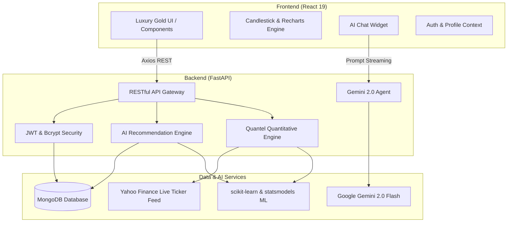

# 🪙 Pocket Buddy — AI-Powered Wealth & Market Intelligence

Pocket Buddy is a full-stack **WealthTech and Quantitative Market Intelligence** web platform designed to democratize high-conviction financial planning, portfolio optimization, and technical trade confirmation through Machine Learning and Generative AI.

---

## 🎨 Luxury Gold & Ivory Design System

Pocket Buddy features a **Luxury Gold, Champagne, Ivory, and Cream** visual language engineered for financial clarity, visual appeal, and readability across desktop, tablet, and mobile devices.

### 🏷️ Master Color Palette & Design Tokens

| Token Name | Hex Code | Visual Application & Purpose |
| :--- | :--- | :--- |
| **Ivory Silk Base** | `#FCFAF1` | Global body background with subtle radial champagne lighting |
| **Champagne Cream** | `#F9F1D7` | Hero backdrops, section highlight headers, badge containers |
| **Warm Sand Glow** | `#F3EBDC` | Sub-panels, hover highlights, table row stripes |
| **Light Gold Border** | `#EEDBBB` | Clean 1px card boundaries, container outlines, chart gridlines |
| **Warm Gold Accent** | `#EFE0B7` | Slider tracks, pill borders, secondary action button outlines |
| **Burnished Gold Gradient** | `linear-gradient(135deg, #B8860B 0%, #D4AF37 50%, #C69234 100%)` | Primary CTA buttons, active ticker tabs, brand badges, logo fill |
| **Deep Espresso Text** | `#1A1610` | Primary headings, KPI figures, card titles (Ultra high contrast) |
| **Warm Walnut / Bronze** | `#5C4F3D` | Subtitles, helper text, chart axis labels, captions |
| **Emerald Gain** | `#047857` | Bullish indicators, profit badges, equity allocations, green candles |
| **Ruby Loss** | `#B91C1C` | Bearish indicators, loss tags, risk warnings, red candles |

### 💎 UX & Accessibility Principles
- **Crisp Text Contrast**: All headings and body metrics use deep espresso (`#1A1610`) and warm walnut (`#5C4F3D`) to avoid washed-out text on light backgrounds.
- **Frosted Ivory Glassmorphism**: Cards use translucent white/ivory bases (`#FFFFFF` / `#FDFBF7`) with subtle backdrop blurs and gold micro-borders (`#EEDBBB`).
- **Device Responsiveness**: Fully fluid multi-breakpoint grid system tested across Mobile (375px), Tablet (768px), and Ultrawide Desktop (1920px).

---

## 🚀 Key Features

### 1. 📊 Live Command Center (Dashboard)
- **Real-Time Market Indices**: Live tracking for NIFTY 50, SENSEX, BANK NIFTY, and key equities with real-time price changes.
- **Interactive Multi-Timeframe Chart**: Price trend graph with custom gold area gradients and 1W / 1M / 6M / 1Y range toggles.
- **Personalized KPI Metrics**: Live investor risk profile, recommended monthly SIP allocation, expected CAGR benchmark, and Financial Health Score.
- **SIP Wealth Growth Simulator**: Interactive slider projecting long-term compounding returns up to 20 years.
- **Market Pulse & Sector Movers**: Live gainers, losers, and sector sentiment pills.

### 2. ⚡ Quantel Pro — Quantitative ML & Trade Confirmation Engine
- **Live Candlestick & Volume Engine**: Interactive candlestick charts with volume bars, hover crosshairs, and dynamic timeframes.
- **6 Advanced Technical Indicators**:
  1. **RSI (14)**: Relative Strength Index measuring overbought (>70) and oversold (<30) momentum.
  2. **Bollinger Bands (20, 2)**: Volatility envelope with Upper, Middle (SMA 20), and Lower bands.
  3. **MACD (12, 26, 9)**: Moving Average Convergence Divergence with MACD line, Signal line, and momentum histogram.
  4. **Stochastic Oscillator (%K, %D)**: Momentum indicator pinpointing turning points.
  5. **Average True Range (ATR 14)**: True market volatility and stop-loss calibration metric.
  6. **Supertrend (10, 3)**: Adaptive trend-following overlay indicating clear Bullish/Bearish directions.
- **Multi-Indicator Trade Confirmation Banner**: Aggregates all 6 technical signals into an algorithmic consensus (Strong Bullish, Bullish, Neutral, Bearish) with a Confidence Score (0–100%).
- **ARIMA ML Forecasting**: Auto-Regressive Integrated Moving Average model projecting short-term price trajectories with confidence bands.
- **Markowitz Portfolio Optimizer**: Computes the optimal asset weights for maximum Sharpe Ratio using Modern Portfolio Theory.
- **Fundamentals & News Intelligence**: Live corporate announcements, income statements, balance sheets, and real-time news sentiment tracking.

### 3. 🎯 AI Asset Allocation & Investment Planning
- **Rule-Based Allocation Engine**: Dynamically distributes capital across Equities, Debt/Bonds, Mutual Funds, and Liquid Reserves tailored to investor risk appetite and timeline.
- **K-Means Clustering (Machine Learning)**: Groups investors with similar financial profiles for collaborative allocation benchmarks.
- **Rebalancing Advice**: Real-time alerts guiding users on when and how to rebalance portfolios to maintain target weights.

### 4. 🤖 AI Financial Assistant (Gemini 2.0 Integration)
- Floating omni-present AI chatbot accessible from every screen.
- Injects user profile (age, income, risk appetite, goals) into context for personalized, actionable financial advice.
- Equipped with smart suggested prompts and rule-based fallback handlers.

---

## 🏗️ System Architecture


```mermaid
graph TD
    subgraph Frontend ["Frontend (React 19)"]
        UI[Luxury Gold UI / Components]
        CC[Candlestick & Recharts Engine]
        CW[AI Chat Widget]
        CTX[Auth & Profile Context]
    end

    subgraph Backend ["Backend (FastAPI)"]
        API[RESTful API Gateway]
        AUTH[JWT & Bcrypt Security]
        REC[AI Recommendation Engine]
        QUANT[Quantel Quantitative Engine]
        CHAT[Gemini 2.0 Agent]
    end

    subgraph Data ["Data & AI Services"]
        DB[(MongoDB Database)]
        YF[Yahoo Finance Live Ticker Feed]
        GEMINI[Google Gemini 2.0 Flash]
        SKLEARN[scikit-learn & statsmodels ML]
    end

    UI -->|Axios REST| API
    CW -->|Prompt Streaming| CHAT
    API --> AUTH
    API --> REC
    API --> QUANT
    AUTH --> DB
    REC --> DB
    REC --> SKLEARN
    QUANT --> YF
    QUANT --> SKLEARN
    CHAT --> GEMINI
```

---

## 💻 Tech Stack

### Frontend
- **Framework**: React 19 (Functional Components, Hooks, Context API)
- **Styling**: Vanilla CSS3 with CSS Custom Properties (Luxury Gold & Ivory Design System)
- **Charts & Visualizations**: Recharts, Canvas Candlestick & Volume Engine
- **Icons**: Semantic SVG Icon System (No generic emojis)
- **HTTP Client**: Axios with global JWT bearer interceptor
- **Routing**: React Router v7

### Backend
- **Framework**: FastAPI (Asynchronous Python Web Framework)
- **Database Driver**: Motor (Async MongoDB Driver)
- **Authentication**: Python-JOSE (JWT Tokens) + Passlib (Bcrypt Hashing)
- **Quantitative & ML Libraries**:
  - `statsmodels` (ARIMA time-series models)
  - `scikit-learn` (K-Means user clustering)
  - `numpy` & `pandas` (Technical indicator computation)
  - `scipy.optimize` (Portfolio weight optimization)
  - `yfinance` (Live market ticker data)
- **AI / LLM**: Google Gemini 2.0 Flash API

### Database
- **Engine**: MongoDB (Local or Atlas)

---

## 📁 Project Structure

```
pocket-buddy/
├── backend/
│   ├── app/
│   │   ├── main.py                  # FastAPI application entry & CORS
│   │   ├── config.py                # Environment configuration (Pydantic)
│   │   ├── database.py              # Motor async MongoDB client
│   │   ├── models/
│   │   │   └── user.py              # User & profile data schemas
│   │   ├── routes/
│   │   │   ├── auth.py              # Registration, login & verification
│   │   │   ├── user.py              # Profile CRUD & risk updates
│   │   │   ├── recommendations.py   # AI asset allocation endpoints
│   │   │   ├── quantel.py           # Real-time technical indicators & ML
│   │   │   └── chatbot.py           # Gemini 2.0 chatbot queries
│   │   ├── services/
│   │   │   ├── auth_service.py      # Authentication business logic
│   │   │   ├── recommendation_service.py # Rule-based & K-Means allocation
│   │   │   ├── quantel_service.py   # Live market data, ARIMA & indicators
│   │   │   └── chatbot_service.py   # Gemini AI prompt orchestration
│   │   └── utils/
│   │       └── auth.py              # JWT token generator & route guard
│   ├── requirements.txt             # Python dependencies
│   └── .env.example                 # Environment variables template
├── frontend/
│   ├── public/
│   │   ├── favicon.ico              # Gold brand favicon
│   │   ├── favicon.svg              # Vector gold brand icon
│   │   └── index.html               # Main HTML template
│   ├── src/
│   │   ├── components/
│   │   │   ├── Navbar.js / .css     # Frosted ivory top navigation
│   │   │   ├── ChatWidget.js / .css # Floating Gemini AI Assistant
│   │   │   ├── CandleStickChart.js  # Canvas candlestick component
│   │   │   └── PrivateRoute.js      # Protected route guard
│   │   ├── context/
│   │   │   └── AuthContext.js       # Global authentication state
│   │   ├── pages/
│   │   │   ├── Dashboard.js / .css  # Command center & live pulse
│   │   │   ├── Recommendations.js / .css # Asset allocation & SIP simulator
│   │   │   ├── Quantel.js / .css    # Quantel Pro technical terminal
│   │   │   ├── Profile.js / .css    # User onboarding & risk survey
│   │   │   └── Login.js / .css      # Luxury authentication screen
│   │   ├── App.js                   # Application router
│   │   ├── index.css                # Luxury Gold & Ivory design system
│   │   └── logo.svg                 # Vector gold brand logo
│   └── package.json                 # Frontend dependencies
└── README.md                        # Documentation & setup guide
```

---

## ⚡ Quick Start & Setup

### Prerequisites
- **Python**: 3.10+
- **Node.js**: 18+
- **MongoDB**: Local community server or MongoDB Atlas instance

---

### 1. Backend Setup

1. Open terminal and navigate to the `backend/` directory:
   ```bash
   cd backend
   ```

2. Create and activate a Python virtual environment:
   ```bash
   # Windows (PowerShell)
   python -m venv venv
   .\venv\Scripts\activate

   # macOS / Linux
   python3 -m venv venv
   source venv/bin/activate
   ```

3. Install required packages:
   ```bash
   pip install -r requirements.txt
   ```

4. Create your `.env` configuration file:
   ```bash
   cp .env.example .env
   ```
   *Update `.env` with your MongoDB connection string and Gemini API Key:*
   ```env
   MONGODB_URL=mongodb://localhost:27017
   DB_NAME=pocket_buddy
   SECRET_KEY=your_super_secret_jwt_key
   GEMINI_API_KEY=your_google_gemini_api_key
   ```

5. Start the FastAPI backend server:
   ```bash
   uvicorn app.main:app --reload --port 8000
   ```
   *The backend API will be live at `http://localhost:8000` (Interactive docs at `http://localhost:8000/docs`).*

---

### 2. Frontend Setup

1. In a new terminal, navigate to the `frontend/` directory:
   ```bash
   cd frontend
   ```

2. Install dependencies:
   ```bash
   npm install
   ```

3. Start the React development server:
   ```bash
   npm start
   ```
   *The application will open automatically at `http://localhost:3000`.*

---

## 📡 API Reference Overview

### 🔐 Authentication (`/auth`)
| Endpoint | Method | Description |
| :--- | :--- | :--- |
| `/auth/register` | `POST` | Create a new user account & return JWT |
| `/auth/login` | `POST` | Authenticate user credentials & return JWT |
| `/auth/me` | `GET` | Fetch authenticated user information |

### 👤 Profile (`/user`)
| Endpoint | Method | Description |
| :--- | :--- | :--- |
| `/user/profile` | `GET` | Get saved profile (age, income, risk appetite, goals) |
| `/user/profile` | `POST` | Update user profile and risk classification |

### 📈 Recommendations (`/recommendations`)
| Endpoint | Method | Description |
| :--- | :--- | :--- |
| `/recommendations/` | `GET` | Get personalized asset allocation and tailored fund recommendations |
| `/recommendations/portfolio-suggestion` | `GET` | Get breakdown by asset class and weights |

### ⚡ Quantel Engine (`/quantel`)
| Endpoint | Method | Description |
| :--- | :--- | :--- |
| `/quantel/market-overview` | `GET` | Live pulse of major indices, top gainers, and top losers |
| `/quantel/stock/{symbol}` | `GET` | Full stock summary, fundamentals, financials, and news |
| `/quantel/market-data/{symbol}` | `GET` | OHLCV historical candlestick data for any period/interval |
| `/quantel/indicators/{symbol}` | `GET` | Computed RSI, Bollinger Bands, MACD, Stochastic, ATR, Supertrend |
| `/quantel/forecast/{symbol}` | `GET` | ARIMA price trajectory projection & confidence bands |
| `/quantel/optimize-portfolio` | `POST` | Calculate optimal weights for maximum Sharpe Ratio |

### 💬 AI Financial Assistant (`/chatbot`)
| Endpoint | Method | Description |
| :--- | :--- | :--- |
| `/chatbot/query` | `POST` | Send financial queries with user profile context to Gemini 2.0 |
| `/chatbot/suggestions` | `GET` | Retrieve contextual starter questions |

---

## 📄 License

This project is licensed under the **MIT License**.

## 👨‍💻 Author

**Pocket Buddy** — Developed by **Mithun M**
